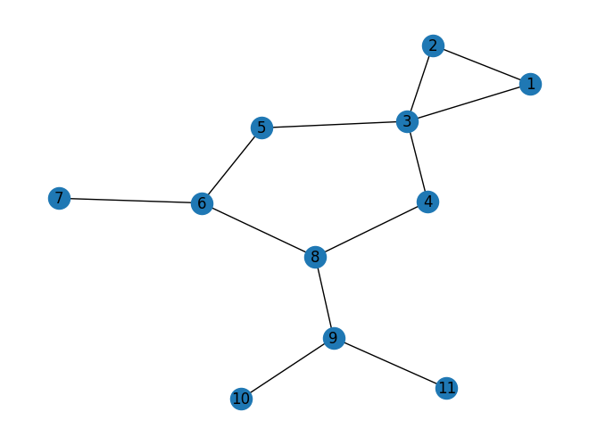
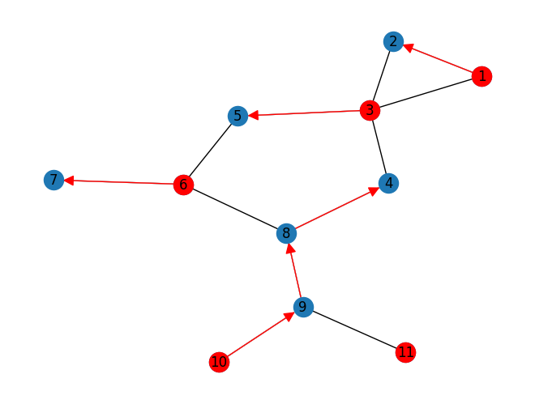
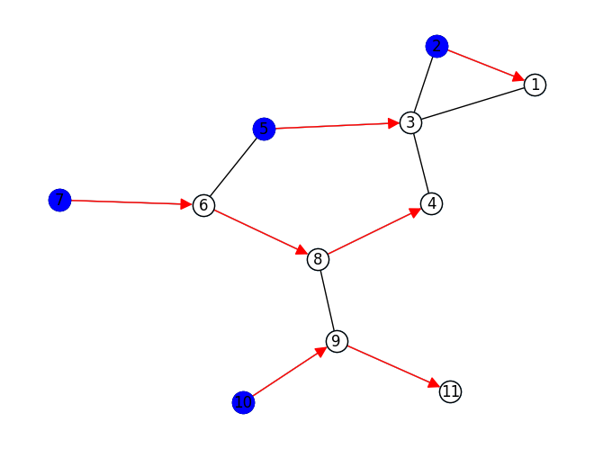
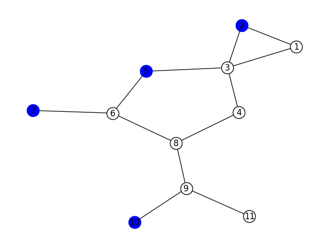
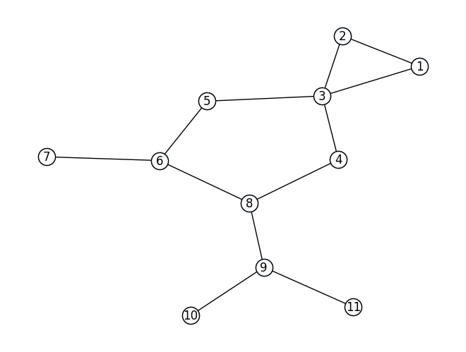

Paper on arXiv: https://arxiv.org/abs/2402.08866

B. Cameron, J. Janssen, R. Matthew, Z. Zhang. An approximation algorithm for zero forcing. *arXiv preprint* <tt>`arXiv:2402.08866 [math.CO]`</tt>


```python
import networkx as nx
from LinkedList import ZeroForcing as ZF
from LinkedList import CJMZ_ZF
from LinkedList.DLinkedList import LinkedList
from LinkedList.DLinkedList import Node
```


```python

# alph = [None, 'a','b','c','d','e','f','g','h','i','j','k','l','m']
H = nx.Graph()

E = [(1,2), (2,3), (1,3),
    (3,5), (5,6), (6,8), (4,8),   (3,4),
    (6,7), (8,9), (9, 10), (9,11)]
H.add_edges_from(E)
bags = [
    [],
    [1],
    [1, 2],
    [1, 2, 3],
    [2, 3],
    [3],
    [3, 4],
    [3, 4, 5],
    [4, 5],
    [4, 5, 6],
    [4, 6],
    [4, 6, 7],
    [4, 6],
    [4, 6, 8],
    [6, 8],
    [8],
    [8, 9],
    [9],
    [9, 10],
    [9, 10, 11],
    [10, 11],
    [11],
    []
]

```


```python
pos = nx.kamada_kawai_layout(H)
nx.draw(H, pos, with_labels= H.nodes())
```


    

    


```python

S, calF, A = CJMZ_ZF.algorithm(H, calX=bags)
print('ZFS: ', S)
print('Fort Packing', calF)
for i, chain in enumerate(A):
    if chain is None:
        continue
    print(i, ':', chain)
# ZF.closure(H, list(set(S)))

```

    ZFS:  [1, 3, 6, 10, 11]
    Fort Packing [[1, 2], [5, 6, 4, 7], [10, 11]]
    1 :  1 ->2 ->
    3 :  3 ->5 ->
    6 :  6 ->7 ->
    10 :  10 ->9 ->8 ->4 ->
    11 :  11 ->


```python
ZF.draw_FAS(H, S, A, pos)
```


    

    


```python
S = [2, 7, 5, 10]
W, A_1 = ZF.closure(H, S)

ZF.draw_FAS(H, S, A_1, pos)

```


    

    


```python

W, A_1 = ZF.closure(H, [])

ZF.draw_ZFS(H, S, pos)


```


    

    


```python
ZF.draw_FAS(H, [], A_1, pos)
```


    

    

